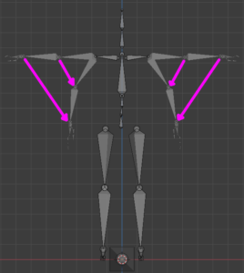
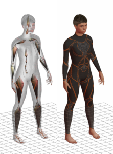

# OpenGLStarter

[Back to HOME](../index.md)

## [/projects/tech-demo-animation] Mesh Skinning

[](https://www.youtube.com/watch?v=-whesQhprAw){:target="_blank" rel="noopener"}

## Mesh Skinning

The mesh skinning is a way to deform a mesh using a simple structure.

For real-time applications, the simple structure is usually the transformation hierarchy.


## 1 Transformation Hierarchy Review

A transformation hierarchy is a tree data structure(graph) that's organize a parent → child relationship of geometric transformations.

You can see an example in the image below:


There are several types, but we are interested in the most common ones: Translation, Rotation and Scale.

We use these transformations combined to positioning, rotating and scaling 3D objects in the virtual scene.

In the past, the transformation was defined by two structures:

* One structure to represent rotation and scale. If we think in 2D, we need a 2x2 matrix. The same way, if we think in 3D, we need a 3x3 matrix.
* Another structure to represent positions. In 2D we have an array [x,y]. In 3D we have an array [x,y,z].

To make it possible to use a single structure to represent the transformation, we use the homogeneous coordinate.

With the homogeneous coordinate we need to add a new line to the matrix where 0 means the structure is a vector and 1 means the structure is a point.

With this representation we can define our transformation with a single matrix.

The interesting part of this representation is that: when we do a matrix by a vector multiplication, the transformation affects the scale and rotation of the vector. When we do a matrix by point multiplication , the transformation affects the position, scale and rotation of a point.

With this representation we can do complex matrix compositions to create our transformation.

When we define a transformation hierarchy, we want the parent nodes to affect all its children.

We can implement this relation using simple matrix multiplications. The transformation is a general term that could be found with other names like: joint, bones, etc...

The image below shows us how to compute the final transformation matrix for each element in the hierarchy using matrix multiplications.


### 1.1 The Matrix X-Ray

If you want to understand more matrix transformations, I suggest you take a look at any classic Computer Graphics book.

The representation of the matrix we use here is column major. It means that each column inside the matrix is our base structure (vector or point).

Take a look at the example below:


Each column is an element in the 3D space as you can see in the gizmo at right.

## 2 The Gradient Matrix

The key to understanding the math behind the mesh skinning is to understand the gradient matrix.

### 2.1 Points and Vectors

I’ll start by giving an example with points and vectors.

If you have two points and want to represent an operation that transforms the point ‘a’ into the point ‘b’ we can calculate the ‘ab’ vector.

Now we don’t need to store the point ‘b’ value, because we can calculate it starting from the point ‘a’ plus the vector ‘ab’.

Take a look at the image below:


### 2.2 Transformation Matrix

Now we can go back with our transformation matrix.

As in the example I did before, you can mathematically do the same thing considering matrix multiplications.

I have the transformation matrix ‘a’ and the transformation matrix ‘b’.

I want to create a matrix ‘ab’ that transforms the matrix ‘a’ into the matrix ‘b’.

Remember that the vector ‘ab’ (b-a) did the work in the points and vectors analysis...

We need to do similar associations but considering matrix operations.

We want to add ‘b’ and subtract ‘a’. To add ‘b’ we need to multiply by ‘b’. To subtract ‘a’ we need to multiply by the inverse of ‘a’.

I called this matrix that transforms ‘a’ into ‘b’ the gradient matrix ‘ab’.

* ‘ab’ = ‘b’ * ’a’ <sup>-1</sup>

Now we can calculate the matrix ‘b’ as follow:

* ‘b’ = ‘ab’ * ‘a’

Take a look at the image below:


### 2.3 The Pose Definition

A pose is a set of transformations that defines a form, shape or parent→children relationship.

Let’s get a starting point pose definition.

We will call this: __bind pose__.

A very common pose is the T-Pose, as you can see in the image below:


Now imagine we want to modify the __bind pose__ to a __target pose__.

The artist can adjust the joints to create new poses, as the example below:


__Back to the math__

We can think the __bind pose__ to be our ‘a’ transformation and the __target pose__ our ‘b’ transformation.

Both are expressed in world space (final matrix transformation).

Take a look at the example below: The __bind pose__ and the __target pose__ are overlapped.


Now we can calculate the __gradient matrix__ ‘ab’ thats allow us to calculate the __target pose__ as a modification of our __bind pose__.

```text
gradient_matrix = ‘ab’ = target_pose * inv(bind_pose)
target_pose =  gradient_matrix * bind_pose
```

In the image below, the pinky arrows are the __gradient matrices__:



## 3 Weighted Vertex Transformation

Now we have a transformation from the __bind_pose__ to the __target_pose__ represented by a single matrix.

We can do some math tricks to do a matrix and points relationships (points and vectors are matrix with 1 column).

This is what we got from the __target_pose__ definition:

```text
gradient_matrix = ‘ab’ = target_pose * inv(bind_pose)
target_pose =  gradient_matrix * bind_pose << this is the important part
```

Now imagine we have a vertex in world space related to the T-Pose (__bind_pose__). Take a look at the image below:


We want to transform it according the gradient that starts at the __bind_pose__ and goes to the __target_pose__.

We can express a point transformation as:

```text
target_point = gradient_matrix * source_point
```

This is the main equation to express the vertex deformation.

### 3.1 Gradient Matrix Linear Interpolation

We can define the vertex deformation influenced by more than one joint/matrix.

This is the magic of the mesh skinning.

The artist can modify the deformation by setting how each joint/bone affect each vertex. At the end it will become a weight relation [0..1].

We can think as we usually do for transformations, instead multiply a set o vertex by the same matrix, we multiply each vertex by several matrix, each of them with a weight.

This sum of weights needs to be 1.

This leads us to a linear interpolation of several gradient matrices per vertex. We also call this weighted relation affine relationship or convex configuration.

We can define the vertex deformation as:

```text
target_point = ( gradient_matrix[joint_0] * weight[joint_0] +
                 gradient_matrix[joint_1] * weight[joint_1] +
                 ... ) * source_point
weight[joint_0] + weight[joint_1] + … = 1
```

The artist set this influences in the 3D editor through the bone vertex paint tool. This process is also called rigging. Take a look at the image below:


With this weighted gradient calculation, we can deform the mesh with several influences.

It is common to use the max of 4 bones influences per vertex to allow us to implement optimized structures to render the mesh using the GPU (we will talk about it later).

The image below is an example of a pose defined with a mesh already deformed by the hierarchy.



### 3.2 Pros & Cons

The main issue on doing the vertex deformation using a linear combination is that it can lead to an incorrect rotation result, because of the linear interpolation between the rotation vectors instead of using the spherical interpolation.

This is not very visible on most cases. There are works that use another kind of combination of the gradient matrix using spherical interpolations or dual quaternions.

For real-time applications, the linear combination is still very used because it is faster and produces good results.

### 3.3 Weighted Vertex Algorithm

How to compute the vertex positions?

I’m considering that each vertex already has the bone/joint influence array.

Pre-processing:

```text
* Vertex world coords
  - Foreach i in vertex.size()
    - vertexworld[i] ← localToWorld_matrix * vertex[i]
* Inverse of the bind_pose
  - Foreach i in bind_pose.size()
    - bind_pose_inv[i] ← inverse_matrix( bind_pose[i] )
```

In the main loop:

```text
* We define the target_pose as we want
* Now we compute the gradient matrix for each bone/joint
  - Foreach i in target_pose.size()
      - gradient_matrix[i] ← target_pose[i]*bind_pose_inv[i]
* Apply the gradient for each vertex
  - Foreach i in vertexworld.size()
    - gradient ← [0]
    - Foreach j in vertex_influence[i].size()
      - influence ← vertex_influence[i][j]
      - gradient ← gradient + gradient_matrix[influence.bone_index] * influence.weight
    - vertexfinal[i] ← gradient * vertexworld[i]
* Finally upload the vertex data to the GPU
```

### 3.4 Normals and Tangents

What do we need to do with the normals and tangents?

We can use the same way we did in the vertex shader to fix the orthogonalization of the normal and the tangent.

Instead of multiplying by the gradient, we multiply by the inverse transpose of the gradient.

__Pre-processing:__

```text
* vertex world coords
  - Foreach i in vertex.size()
    - vertexworld[i] ← localToWorld_matrix * vertex[i]
    - N ← transpose(inv(localToWorld_matrix)) * normal[i]
    - N ← N / |N| // normalize
    - T ← localToWorld_matrix * tangent[i]
    - T ← T / |T| // normalize
    - T ← T – (T . N)*N  // re-orthogonalize the tangent, uses dot product
    - T ← T / |T| // normalize
    - normalworld[i] ← N
    - tangentworld[i] ← T
* inverse of the bind_pose
  - Foreach i in bind_pose.size()
    - bind_pose_inv[i] ← inverse_matrix( bind_pose[i] )
```

__In the main loop:__

```text
* Foreach i in vertexworld.size()
  - gradient ← [0]
  - Foreach j in vertex_influence[i].size()
    - influence = vertex_influence[i][j]
    - gradient ← gradient + gradient_matrix[influence.bone_index] * influence.weight
  - vertexfinal[i] ← gradient * vertexworld[i]
  - N ← transpose(inv(gradient)) * normalworld[i]
  - N ← N / |N| // normalize
  - T ← gradient * tangentworld[i]
  - T ← T / |T| // normalize
  - T ← T – (T . N)*N  // re-orthogonalize the tangent, uses dot product
  - T ← T / |T| // normalize
  - normalfinal[i] ← N
  - tangentfinal[i] ← T
```

__Final Considerations__

The pre-processing step of the algorithm is OK, because we do it only once.

The problem is with the main loop, because it occurs 60, 75, 120, 240 times per second.

The transformation hierarchy computation is near instantaneous, because it compute about 40 nodes (joints/bones) for a humanoid character.

The vertex multiplications are processed over 3k to 20k elements (vertex, normals and tangents) according to the 3D model complexity.

__To Optimize More__

We can use the GPU to process the skinning data, transferring this cost to the GPU.

By that way we need to process and upload to the GPU about 40 matrices instead of processing and transmit 3k to 20k vertex + normals + tangents each frame.

## 4 GPU Skinning

We can use the GPU to compute the vertex skinning. To do that we need to create an additional uniform structure to store the array of gradient matrices.

In the past, the matrix limit that can be stored in a uniform buffer of a vertex shader was about 128, today this max count might be increased.

In addition to the uniform, we need 2 new vertex attributes: the gradient matrix index and the weight associated with this matrix. We can use the vec4 data type to store 4 influences per vertex.

What we need to do if the vertex has less than 4 influences?

In the pre-processing step we can calculate all indexes and weights normally. When we need to fill the index and weights that we don’t use, we can repeat the last accessed matrix and set the weight to 0 in order to favor the memory cache (the matrix access).

__Pre-Processing:__

The shader language reference I use is the #version 120, to run in my 2011 mac. This version does not allow us to pass an integer as a vertex attribute. For this reason, we need to use float point to index the gradient array.

The vertex_weight structure is an array of arrays. They store the vertex influence. The skin_index and skin_weights are vec4 data type.

```text
* skin_index.resize(vertex_weight.size())
* skin_weights.resize(vertex_weight.size())
* Foreach i in vertex_weight.size()
  - last_index ← 0
  - For j ← 0 to 3
    - If j < vertex_weight[i].size()
      - last_index ← float(vertex_weight[i][j].bone_index) + 0.2
      - skin_index[i][j] ← last_index
      - skin_weights[i][j] ← vertex_weight[i][j].weight
    - else
      - skin_index[i][j] ← last_index
      - skin_weights[i][j] ← 0
```

__The new algorithm in the main loop__

```text
* We define the target_pose as we want
* We compute the gradient matrix for each bone/joint
* We upload the gradient matrix array to the GPU
* Issue a draw call using a static Vertex Buffer Object
```

In the vertex shader, you just need to add the gradient calculation before use the position value as you can see below:

```cpp
// aSkinIndex and aSkinWeight are 2 new attributes
attribute vec4 aSkinIndex;
attribute vec4 aSkinWeight;
// uSkinGradientMatrix is the gradient matrix array
uniform mat4 uSkinGradientMatrix[32];
mat4 v_gradient_ = mat4(0);
for (int i=0;i<4;i++){
    v_gradient_ += uSkinGradientMatrix[int(aSkinIndex[i])] * aSkinWeight[i];
}
vec4 inputPosition = v_gradient_ * aPosition;
…
// normal vertex shader algorithm
...
gl_Position = uMVP * inputPosition;
```
