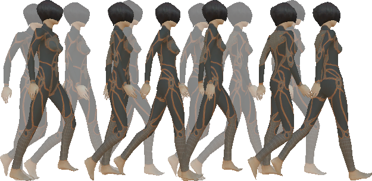
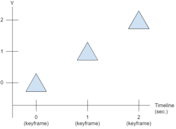
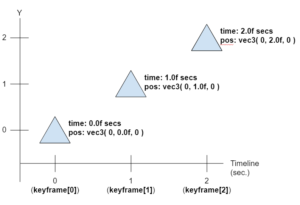
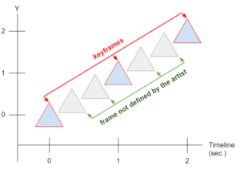
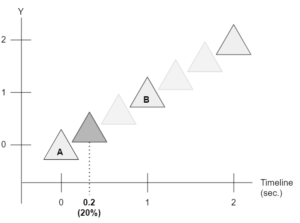
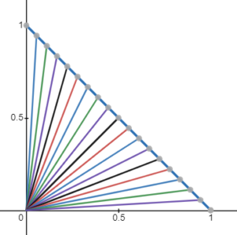
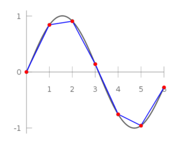
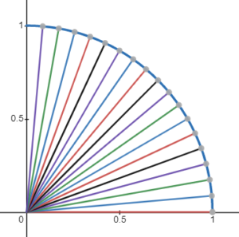
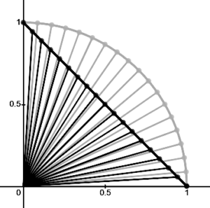

# OpenGLStarter

[Back to HOME](../index.md)

## [/projects/tech-demo-animation] Skeletal Animation

[](https://www.youtube.com/watch?v=-whesQhprAw){:target="_blank" rel="noopener"}

## Skeletal Animation

Skeletal animation is a way of giving life, movement, smoothness to sequences of poses using geometric transformations.

Our concern in this post is centered on how to perform this frame transition from one pose to another.



## 1 Context

Animation in computer graphics is a vast area. It can be performed in several ways: procedural generation, changing images/sprites that are in a sequence, modifying vertices or their properties, or any modification of parameters that visually affect an object.

All of them are based on modifying the look of what is presented on the screen considering the variation of time. So we need to somehow store this time variance.

In this post we will present the animation applied to transformation matrices.

We call skeleton the hierarchical structure we generally use to control mesh skinning (which was the theme of our previous post).

Despite the name of this post being skeletal animation, this technique can be used to animate any structure of hierarchical transformations.

When we want to create an animation we have the definition of a frame. In our context, a frame is any set of parameters that have been created or calculated to help us define our final pose, or set our final transformations.

## 2 Keyframes

When an artist is creating a computer animation, he usually doesn't work on all frames. He creates important frames that highlight the movement and its intent.

This important frame is called keyframe.

All other frames are approximated, interpolated, or extrapolated.

So our animation is basically composed of two types of parameter sets (frames): the ones the artist defined, and the ones the artist didn't define.

There is a difference between them that can guide us in this post.

When we talk about parameters, we think about curves. Each curve controls the behavior of a parameter.

When a curve is approximate, it does not pass through the control points. When it is interpolated, it passes through the control points. Extrapolations may or may not pass through control points, but they extrapolate the defined movement.

There are numerous equations to handle each of these cases: linear, hermite, spline families (spline, b-spline, catmullrom-splines, etc...), bezier, etc...

If you want to delve into this world of equations, I also suggest you take a look at classic computer graphics books.

When an artist creates animation states, he usually uses more robust tools with several interpolation options. When it exports the 3D model for real-time applications, this complex information is transformed into simpler information so that playback software can work with these equations.

So here we'll stick to the simplest case, which is using linear equations to handle interpolations.

### 2.1 How to Code Keyframes?

To code keyframes we have to think that they are sets of values associated with a certain time (timestamp).

The simplest way would be to store an array of structures, where we would have a field that indicates the time and another field with our parameter (position, rotation or scale).

You can complicate these definitions as much as you like. I've seen implementations where an array is used for each component in the position. One for 'x', one for 'y' and one for 'z'. It gives more control over the parameters, but in our case, we want to simplify it as much as possible.

Let's see an example of a positional animation with 3 frames: one at the beginning that defines the initial state, an intermediate one, and an ending one. Take a look at the image below:



In the example image we have the variation represented only for the ‘Y’ axis, but you can assume that we have stored all 3 components of a 3D coordinate or 2 components of a 2D coordinate. When we represent rotations, we can store the quaternion of each keyframe as well.

We can store this sequence of keyframes using the structures below (in c++):

```cpp
// Positional Structure
struct KeyframePos {
    float time; // seconds
    vec3f pos;
    KeyframePos(float time, const vec3f &pos) {
        this->time = time;
        this->pos = pos;
    }
};
// Rotational Structure
struct KeyframeRot {
    float time; // seconds
    quatf rot;
    KeyframeRot(float time, const quatf &rot) {
        this->time = time;
        this->rot = rot;
    }
};
```

We can initialize an array representing this animation as follows:

```cpp
std::vector<KeyframePos> channelPosition;
channelPosition.push_back( KeyframePos( 0.0f, MathCore::vec3f( 0, 0.0f, 0 ) ) );
channelPosition.push_back( KeyframePos( 1.0f, MathCore::vec3f( 0, 1.0f, 0 ) ) );
channelPosition.push_back( KeyframePos( 2.0f, MathCore::vec3f( 0, 2.0f, 0 ) ) );
```

It's important to keep this array sorted by time to make our algorithm easier later on.

Now our timeline can be represented with the following image:



Now that we have a way to define our keyframes, we can think of how to calculate the intermediate values (which were not defined by the artist). So we can think about the interpolations.

## 3 Interpolations

An interpolation is the calculation of intermediate states of parameters, where these parameters pass through the control points, that is, they pass through the states defined by the artist.

Let's take the previous example. We are interested in the positions that were not defined by the artist. Take a look at the image below:



### 3.1 How to Calculate Interpolations?

To calculate an interpolation we have to calculate what percentage the current time is in relation to the times of the nearest keyframes.

Take a look at the image below:



In this example, the current time of our simulation is 20% (or 0.2) between the time of 'A' and 'B'.

Animations can be coded to play forward or backward. We will assume that the animations are played forward only, so we can create an algorithm that calculates the percentage of the current time over our keyframe array (which doesn't need to traverse the entire array to find the interpolation position).

Take a look at the code below:

```cpp
class QueryInterpolationPos {
 
public:
    void QueryInterpolationPos() {
        lastIndexA = -1;
        lastIndexB = -1;
        lastLrp = 0.0f;
        lastTimeQuery = 0.0f;
    }
 
    void queryInterval_ForwardLoop(
        const std::vector<KeyframePos> &channel, float time, 
        KeyframePos **out_A, KeyframePos **out_B, float *out_lrp ) {
 
        if (lastIndexA == -1) {
            // initialize data
            lastIndexA = 0;
            lastIndexB = 1;
            lastLrp = 0.0f;
            lastTimeQuery = channel[0].time;
        }
 
        if (channel.size() == 0) {
            *out_A = *out_B = nullptr;
            *out_lrp = 0.0f;
            return;
        } else if (channel.size() == 1) {
            *out_A = *out_B = &channel[0];
            *out_lrp = 0.0f;
            return;
        }
 
        time = clamp(time, channel[0].time, channel[channel.size() - 1].time);
 
        if (time < lastTimeQuery) {
            // reset query
            lastIndexA = 0;
            lastIndexB = 1;
            lastLrp = 0.0f;
            lastTimeQuery = channel[0].time;
        }
 
        if (time > lastTimeQuery) {
            lastTimeQuery = time;
            for (; lastIndexA < channel.size() - 2; lastIndexA++) {
                if (time < channel[lastIndexA + 1].time)
                    break;
            }
            lastIndexB = lastIndexA + 1;
        } else {
            // same time query
            *out_A = &channel[lastIndexA];
            *out_B = &channel[lastIndexB];
            *out_lrp = lastLrp;
            return;
        }
 
        float delta = (channel[lastIndexB].time - channel[lastIndexA].time);
 
        if (delta <= 1.0e-6)
            lastLrp = 0.0f;
        else
            lastLrp = (time - channel[lastIndexA].time) / delta;
 
        *out_A = &channel[lastIndexA];
        *out_B = &channel[lastIndexB];
        *out_lrp = lastLrp;
    }
};
```

The code presented shows how to search for the position keyframes. The logic to search for rotations is the same, just changing the KeyframePos to KeyframeRot.

Once we have the keyframe A (out_A), the keyframe B (out_B) and the percentage that the current time is in relation to these (out_lrp), we can think of which equation to use in the interpolation.

There are two types of interpolation: positional and rotational.

It is not usual to perform scaling interpolations, but you can also consider this possibility.

### 3.2 Positional Interpolation



The key point of positional interpolation is to keep the distance variation constant, even though this may not generate constant angle variations.

For positional interpolation, we can use linear interpolation. The result we get with this interpolation is the movement performed in straight lines that connect the points of the positions defined in the keyframes.

It is generally not necessary to worry about whether the interpolated values approximate the movement created by the artist or not, because the exporting tools make a large sample of the movement that was created (animation bake), making these values as close as possible to the original curve.

See the algorithm below:

```cpp
vec3f lerp(const vec3f &a, const  vec3f &b, float factor) {
    return a * (1.0f - factor) + (b*factor);
}
```

Imagine that the movement desired by the artist is to walk over an arc, but when exporting to use linear interpolation, we have this result:



The gray line is the desired move. The blue line is the result of linear interpolation.

Usually this difference between the interpolations is not noticeable.

### 3.3 Rotational Interpolation



The key point of rotational interpolation is to keep the angle change constant rather than keeping the distance change constant. Another important point is that the positions generated by this interpolation follow the silhouette of a circle, keeping the distance to the center of rotation constant.

For this type of interpolation we can speak of quaternions.

So far we have talked about building our transformation with matrices only.

Now we are talking about quaternions, because it is another mathematical structure that helps us to get good results with a low computational cost.

#### 3.3.1 Quaternions

A quaternion is a mathematical structure with 4 values, 3 coordinates in complex space (with imaginary numbers) where we can store rotations and scales. In computer graphics it is generally used to represent rotations only.

Quaternions are more interesting than matrices for representing rotations because they avoid a phenomenon called gimbal-lock, which can occur when you handle rotations using only matrices.

Gimbal-lock is a state of composing rotations (example: Euler rotation) in which 2 or more axes of rotation are aligned. We have 2 problems when that occurs:

* The rotation of these 2 axes results in the same final rotation;
* The interpolation of 2 rotations can generate an arc that does not 'walk' in the minimum arc from a source rotation to the target rotation.

The annoying issues to work with quaternions are the operations that can be performed on them, since the coordinate space is the complex space.

The operations that I consider important are related to:

* Create a rotation from known parameters (eg Euler rotations);
* Transform this representation into a matrix to use in our rendering system.

Many books feature implementations of quaternion operations, so we need to know what they do in order to use them.

#### 3.3.2 Equations and Algorithms

Our rotation keyframes will now be stored in quaternions and the main operation we will use is SLERP (spherical linear interpolation).

SLERP performs the constant variation of angles from a source quaternion to a target quaternion.

The way to use it looks like linear interpolation. We have a source ‘a’ quaternion, a target ‘b’ quaternion, and a factor from 0 to 1 that tells what percentage we want to rotate from ‘a’ to ‘b’.

See the algorithm below:

```cpp
quatf slerp(const quat& a, const quat& b, float lerp) {
    if (lerp <= 0.0f) return a;
    if (lerp >= 1.0f) return b;
 
    float _cos = dot(a, b);
    quatf _new_b_(b);
    if (_cos < 0.0f) {
        _new_b_ = -b;
        _cos = -_cos;
    }
    float a_factor, b_factor;
    if (_cos > (1.0f - EPSILON)) {
        a_factor = 1.0f - lerp;
        b_factor = lerp;
    } else {
        float _sin = sqrt(1.0f - _cos * _cos);
        float _angle_rad = atan2(_sin, _cos);
        float _1_over_sin = 1.0f / _sin;
        a_factor = sin((1.0f - lerp) * _angle_rad) * _1_over_sin;
        b_factor = sin((lerp)* _angle_rad) * _1_over_sin;
    }
    return a_factor * a + b_factor * _new_b_;
}
```

It is possible to implement this type of interpolation with vectors as well, see the algorithm below:

```cpp
vec3f slerp(const vec3f& a, const vec3f& b, float lerp) {
    float _cos = clamp(dot(normalize(a), normalize(b)), -1.0f, 1.0f);
    float angle_rad = acos(_cos);
    float _sin = sin(angle_rad);
    if (abs(_sin) < EPSILON)
        return aRibeiro::lerp(a, b, lerp);
    float a_factor = sin((1.0f - lerp) * angle_rad) / _sin;
    float b_factor = sin(lerp * angle_rad) / _sin;
    return a * a_factor + b * b_factor;
}
```

It is not common to use a vec3f to represent rotations, but this function can be useful in other situations.

### 3.4 Comparing Interpolations

When we put the result of the interpolations overlapped, we can see that they generate different results.

Take a look at the image below:



The trajectory of rotational interpolation follows the arc of the circle, while positional interpolation follows a straight line.

One issue raised in the previous post is that the interpolation used as an example is only linear.

With the image above you can see that when we use a linear interpolation, it does not keep the same angular variation, which is the premise of rotational interpolation. In the case of mesh skinning, the result can look bad, depending on how the parameters are interpolated. But for most cases, it's not noticeable.

### 3.5 Interpolation Usage Example

Now that we know how to do the interpolations, we can use our algorithm that search for keyframes and use their result in both positional and rotational interpolation.

Take a look at the example below:

```cpp
void example_query_position() {
    std::vector<KeyframePos> channelPosition;
    QueryInterpolationPos queryInterpolationPos;
 
    //initialize the position channel
    //...
 
    KeyframePos *out_A, *out_B;
    float out_lrp;
 
    //query time 0.2 in the timeline
    queryInterpolationPos.queryInterval_ForwardLoop( 
        &channelPosition, 0.2f, // vector, seconds
        &out_A, &out_B, &out_lrp // output parameters
    );
 
    //check if found a keyframe
    if (out_A == nullptr)
        return;
 
    //now we can compute our interpolation
    vec3f result = lerp( out_A->pos, out_B->pos, out_lrp);
}
```

For rotation, the code is similar. We just need to change lerp to slerp, and use quaternions instead of vec3f.

## 4 Animation Channel Set

An animation channel can be defined as an interpolation (positional or rotational) applied directly to an array of parameters (position, rotation or scale) considering a timeline.

We are interested in a more complete definition that can be applied directly to a node in our transformation hierarchy. For that, we can put together a set of attributes and say that this will be our set of animation channels that represent our transformation.

This set can use linear interpolation for position and scale, and rotational interpolation for rotation.

Knowing that the interpolation structures work the same way (with the same percentage parameter), we can create a control class that calculates each of these parameters and returns to us a single matrix with the result of all the interpolations combined.

See an example of the transformation class definition:

```cpp
class TransformAnimation {
public:
    std::vector<KeyframePos> channelPosition;
    QueryInterpolationPos queryInterpolationPos;
    std::vector<KeyframeRot> channelRotation;
    QueryInterpolationRot queryInterpolationRot;
 
    vec3f queryPosition(float time) {
        KeyframePos *out_A, *out_B;
        float out_lrp;
        queryInterpolationPos.queryInterval_ForwardLoop( 
            &channelPosition, time, // vector, seconds
            &out_A, &out_B, &out_lrp // output parameters
        );
        if (out_A == nullptr)
            return MathCore::vec3f(0);
        return lerp( out_A->pos, out_B->pos, out_lrp);
    }
 
    quatf queryRotation(float time) {
        KeyframeRot *out_A, *out_B;
        float out_lrp;
        queryInterpolationRot.queryInterval_ForwardLoop( 
            &channelRotation, time, // vector, seconds
            &out_A, &out_B, &out_lrp // output parameters
        );
        if (out_A == nullptr)
            return quatf(0,0,0,1);
        return slerp( out_A->rot, out_B->rot, out_lrp);
    }
 
    mat4f computeMatrix(float time) {
        vec3f pos = queryPosition(time);
        quatf rot = queryRotation(time);
        return translateMatrix(pos) * GEN<mat4f>::fromQuat(rot);
    }
};
```

As you can see from the code, we only need to pass the current time to the transform controller. Internally it already combines the different types of parameters computing the final matrix, so we can use it in our rendering.

### 4.1 Inverse/Forward Kinematics

Another question that arises when dealing with animations is what kind of kinematics we are going to use.

In forward kinematics you have a set of angles associated with the transformation nodes and at the end the final position of each node is calculated.

See the equation below:

__P = f(Θ)__

In inverse kinematics you have a set of end positions, and a simultaneous equation solving algorithm calculates what angle configuration you need to assign to each node to reach those end positions.

See the equation below:

__Θ = f<sup>-1</sup>(P)__

Editors often use inverse kinematics to make it easy to control the animation. But this has a high computational cost. So high, that real time applications, when using this approach, apply only to the character's feet, not the entire body.

On the other hand, after exporting the animation, the software uses forward kinematics.

The main advantage of forward kinematics is that the computation of transform node positions can be performed with a simple matrix multiplication. It is computationally lighter than inverse kinematics.

Remember how we calculate the final matrix of a hierarchy of transformations from our previous post?

Well, to calculate the forward kinematics, we have to do exactly the same. Just multiply the parent node's matrix by the child node's matrix.

An advantage of this approach is that we can store animation values in the local space of each node in the hierarchy.

With these settings, we can now create our animation.

At each time sample in our timeline we will calculate the necessary interpolation.

This leads us to have our pose definition interpolated from our skeleton.

In the example below we can see the keyframes and the interpolated frames:


The algorithm to use this type of animation is shown below:

```text
For each time sample ‘time’:
    1 For each transformation ‘transform’
        transform ← transformAnimation.computeMatrix( time )
    2 Compute the final matrix (multiply all hierarchy matrices)
    3 Send the final matrix set to render the 3D model
        Here you can compute the skinning or send the matrices to the shader
```

## 5 Transitions

Let's now consider that an animation is a set of channel parameters of all nodes of a character. Let's also consider that this character can have multiple animations.

When we want to switch from one animation to another we can use a transition.

A transition is an intermediate state between two animations.

The idea behind implementing a transition is very simple:

* Calculate all the interpolations of the parameters of animation ‘1’ and animation ‘2’;
* Combine the parameter results of the animation ‘1’ with the animation ‘2’ using an ‘lrp’ parameter;
* Create the final transformation matrix from the previous result.

### 5.1 Algorithm

Consider three parameters:

* ‘lrp’ as the interpolation parameter between animations (0 to 1);
* ‘time_a’ the current time of the animation ‘1’;
* ‘time_b’ the current time of the animation ‘2’.

We need to do 2 types of processing: one that processes channels that are independent and another that processes shared channels.

__Note__: A shared channel is an animation channel that changes in both animation ‘1’ and animation ‘2’.

The logic for processing the independent channels works as described earlier.

Now in shared channels we can use the following algorithm:

```text
For each shared channel ‘a’ of animation ‘1’:
    ‘b’ ← find the animation channel ‘2’ that shares the same transformation as ‘a’
    a_pos ← ‘a’.queryPosition( time_a )
    b_pos ← ‘b’.queryPosition( time_b )
    result_pos ← lerp( a_pos, b_pos, lrp )
    a_rotation ← ‘a’.queryRotation( time_a )
    b_rotation ← ‘b’.queryRotation( time_b )
    result_rotation ← slerp( a_rotation, b_rotation, lrp )
    result_matrix ← GEN<MathCore::mat4ff>::translateHomogeneous( result_pos ) * quat2mat4f( result_rotation )
```

With this algorithm we can apply the animation transition to any hierarchical transformation structure.

Combining poses can lead to strange visual results, but these results depend on how the artist when he is creating the animation curves and also how the programmer defined the blending algorithms.
