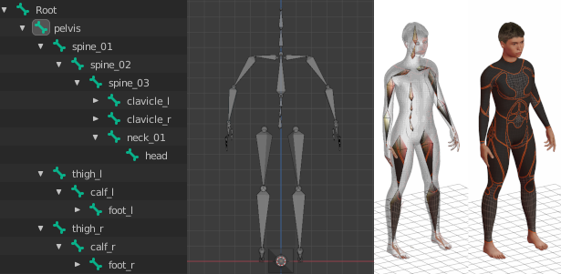

# OpenGLStarter

[Back to HOME](../index.md)

## [/projects/tech-demo-animation] Root Motion

[](https://www.youtube.com/watch?v=-whesQhprAw){:target="_blank" rel="noopener"}

## Root Motion

When you're programming a character's movement, it's often necessary to set the speed parameter.

Some cases the character moves faster, other times it moves slower, until we hit the right parameter setup. This process might not work for all the animations that were included in the project.

This post will open a discussion on how to let the movement be controlled by the artist. By that way we can stop trying to guess what the characters' movement parameters are.


## 1 Context

It is common to use character or object movements in interactive applications (animations or digital games).

When we make a character controller, we usually put a lot of parameters to make it more flexible so that we can use this code in multiple projects.

Now let's reflect a little: How much effort does it take to create flexible and adaptable code? In all the projects you've done, how many motion control classes have you written?

The main motivation of this post is to raise one more option for yours technological knowledge that can be used to create the movement of characters.

The idea here is to let the artist create a movement of the character in the 3D editor he already uses.

## 2 Skeleton Organization

There are no restrictions on how to create a skeleton to use in a 3D project. But in our case, we need to have a parent node (a transformation) of all transformations that we will call the root node.

The artist can setup the animation on all nodes of the skeleton, but the movement he will only place on the root node.

With this restriction, the artist defines how the movement should occur, not the programmer.

The main benefit of the artist defining the movement is that the character's movement will be more realistic.

The image below is an example of the hierarchy created by MakeHuman for a humanoid character:



Note that all nodes in the hierarchy are direct or indirect children of the node named ‘__Root__’.

In this example, the movement animation must be assigned/stored in the Root node.

If you want to see more details on how to store and process animations, you can see our post on skeletal animation.

## 3 Algorithm

Now that we have an animation on the root node, we can move on to the implementation.

When we're working with an animation, it can be cyclic or it can be non-cyclic.

The most complex case is cyclic animation, as it must define what happens when the animation is restarted. Unlike other posts, we will address the most complex case. It is quite common to have this type of animation (example: walking cycle).

Note: When using the root node information to move the 3D character, we will not apply the transformation to the character (example: skinning). Instead, we'll figure out what delta or variation we should apply to the root node that contains our character's 3D model.

### 3.1 Non-Cyclic Sequence

This is the simplest case, we just need to calculate what the final position the node will have according to the animation and use this information to modify the character's position in the world.

In the update method, we must apply the animation to the root node, store its position, set the root position to the initial value and calculate what variation should be applied to the character's node.

Take a look at the image below:


As the time variation increases only, the delta calculation is also straightforward.

The algorithm looks like this:

```text
- Update
    - previous_position_world ← root.getLocalToWorldMatrix() * [0,0,0]T
    - Transform the root node as its animation channel wants
    - new_position_world ← root.getLocalToWorldMatrix() * [0,0,0]T
    - root.setPositionFromWorldSpace( previous_position_world )
    - delta_world ← new_position_world - previous_position_world
    - characterNode.translate(delta_world)
```

### 3.2 Cyclic Sequence

There are two negative situations when we are dealing with a cyclic animation:

* The algorithm may consider a motion delta too large when the animation time passes by 0 (and the animation is restarted).
* When the animation is short, and the elapsed time is longer. The ideal case is that you consider the several times the animation must run to perform the correct movement. If you don't consider this, the character may move little compared to what it should be moved.

The solution to the first situation is to use a calculation of the delta that occurs between the animation frames. In the second case, I will leave it open for you to think about the solution.

Let's use the algorithm from our previous post and increment it to detect when time passes by keyframe 0. That way we can add a count of the delta at the end of the animation plus the delta at the beginning of the animation.

Take a look at the image below:


In this situation, when performing the time increment, it can be restarted considering the total time of the timeline.

When this situation occurs, we need to sum the delta from the increment start to the timeline end with the timeline start with the increment end.

Take a look at the algorithm below:

```cpp
class QueryInterpolationPos {
public:
   void QueryInterpolationPos() {
       lastIndexA = -1;
       lastIndexB = -1;
       lastLrp = 0.0f;
       lastTimeQuery = 0.0f;
   }
   void queryInterval_ForwardLoop(
       const std::vector<KeyframePos> &channel, float time,
       KeyframePos **out_A, KeyframePos **out_B, float *out_lrp,
       vec3f *interquery_delta = NULL ) {
       if (lastIndexA == -1) {
           // initialize data
           lastIndexA = 0;
           lastIndexB = 1;
           lastLrp = 0.0f;
           lastTimeQuery = channel[0].time;
       }
       if (channel.size() == 0) {
           *out_A = *out_B = NULL;
           *out_lrp = 0.0f;
 
           // new code
           if (interquery_delta != NULL)
               *interquery_delta = MathCore::vec3f(0);
          
           return;
       } else if (channel.size() == 1) {
           *out_A = *out_B = &channel[0];
           *out_lrp = 0.0f;
 
           // new code
           if (interquery_delta != NULL)
               *interquery_delta = MathCore::vec3f(0);
          
           return;
       }
       time = clamp(time, channel[0].time, channel[channel.size() - 1].time);
       if (time < lastTimeQuery) {
          
           // new code
           if (interquery_delta != NULL) {
               vec3f lastReturned = lerp(channel[lastIndexA].pos, channel[lastIndexB].pos, lastLrp);
               *interquery_delta = channel[channel.size() - 1].pos - lastReturned;
           }
 
           // reset query
           lastIndexA = 0;
           lastIndexB = 1;
           lastLrp = 0.0f;
           lastTimeQuery = channel[0].time;
       } else {
 
           // new code
           if (interquery_delta != NULL)
               *interquery_delta = MathCore::vec3f(0);
 
       }
       vec3f lastReturned;
 
       if (time > lastTimeQuery) {
 
           // new code
           if (interquery_delta != NULL)
               lastReturned = lerp(channel[lastIndexA].pos, channel[lastIndexB].pos, lastLrp);
 
           lastTimeQuery = time;
           for (; lastIndexA < channel.size() - 2; lastIndexA++) {
               if (time < channel[lastIndexA + 1].time)
                   break;
           }
           lastIndexB = lastIndexA + 1;
       } else {
           // same time query
           *out_A = &channel[lastIndexA];
           *out_B = &channel[lastIndexB];
           *out_lrp = lastLrp;
           return;
       }
       float delta = (channel[lastIndexB].time - channel[lastIndexA].time);
       if (delta <= 1.0e-6)
           lastLrp = 0.0f;
       else
           lastLrp = (time - channel[lastIndexA].time) / delta;
 
       // new code
       if (interquery_delta != NULL) {
           vec3f result = lerp(channel[lastIndexA].pos, channel[lastIndexB].pos, lastLrp);
           *interquery_delta += result - lastReturned;
       }
 
       *out_A = &channel[lastIndexA];
       *out_B = &channel[lastIndexB];
       *out_lrp = lastLrp;
   }
};
```

Note that we use the comment '// new code' on the parts of the algorithm that have been modified.

Our interpolation method now returns the variation that occurred from one frame to another via the '__interquery_delta__' return parameter.

Now we can create an algorithm to control our character.

Take a look at the algorithm below:

```cpp
class TransformAnimation {
public:
   std::vector<KeyframePos> channelPosition;
   QueryInterpolationPos queryInterpolationPos;
   std::vector<KeyframeRot> channelRotation;
   QueryInterpolationRot queryInterpolationRot;
 
 
   // root motion variables
   bool process_as_root;
   vec3f start_position_local;
 
   TransformAnimation() {
       this->process_as_root = false;
   }
 
   // should call this after fill at least
   //   the first frame of the position channel
   void initialize(bool process_as_root) {
       this->process_as_root = process_as_root;
       if (process_as_root)
           start_position_local = channelPosition[0].value;
   }
   vec3f queryPosition(float time, vec3f *interquery_delta_local = NULL) {
       KeyframePos *out_A, *out_B;
       float out_lrp;
       if (!process_as_root)
            interquery_delta_local = NULL;
       queryInterpolationPos.queryInterval_ForwardLoop(
           &channelPosition, time, // vector, seconds
           &out_A, &out_B, &out_lrp, // output parameters
           interquery_delta_local
       );
       if (out_A == NULL)
           return MathCore::vec3f(0);
      
       if (process_as_root) {
           return start_position_local;
       } else
           return lerp( out_A->pos, out_B->pos, out_lrp);
   }
   quatf queryRotation(float time) {
       KeyframeRot *out_A, *out_B;
       float out_lrp;
       queryInterpolationRot.queryInterval_ForwardLoop(
           &channelRotation, time, // vector, seconds
           &out_A, &out_B, &out_lrp // output parameters
       );
       if (out_A == NULL)
           return quatf(0,0,0,1);
       return slerp( out_A->rot, out_B->rot, out_lrp);
   }
   mat4f computeMatrix(float time, vec3f *interquery_delta = NULL) {
       vec3f pos = queryPosition(time, interquery_delta);
       quatf rot = queryRotation(time);
       return translateMatrix(pos) * GEN<mat4f>::fromQuat(rot);
   }
};
```

Note that we must call the '__initialize__' method telling it whether this animation node is root or not.

In case it's root, we can use the '__interquery_delta__' return parameter to move our character.

Now using this class we can animate our character as follows:

```cpp
float anim_duration = ...;
TransformAnimation root_anim;
// ... fill the animation channels
root_anim.initialize(true);
 
// auxiliary variables
vec3f interquery_delta;
vec3f world_pos = MathCore::vec3f(0,0,0);
float anim_time = 0.0f;
 
// now the update
void Update(float elapsed_sec) {
    anim_time = MathCore::OP<float>::fmod(anim_time + elapsed_sec, anim_duration);
    mat4f render_matrix = root_anim.computeMatrix(anim_time, &interquery_delta);
    // finally move the character
    world_pos = world_pos + interquery_delta;
    mat4f character_move_transform = translateMatrix(world_pos) * render_matrix;
    // ...
}
```
