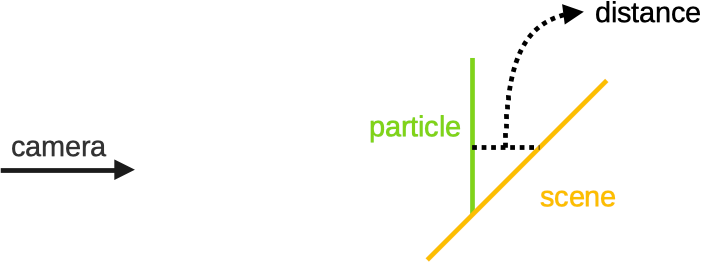

# OpenGLStarter

[Back to HOME](../index.md)

## [/projects/tech-demo-particle]

[](https://www.youtube.com/watch?v=VT6OaSV5d38){:target="_blank" rel="noopener"}

## Before Starting

I'm considering that you already have a working particle system.

A particle system is a module, class, function or whatever abstraction you can create and updates a list of positions with attributes like size, color, etc...

The particle system can be implemented to run in CPU or GPU.

After simulating the animation of the particles, you need to create a structure the GPU knows to do the rendering in the viewport.

### The OpenGL Starter Framework Particle System

The framework particle system is a CPU based one.

It generates and computes the positions and its attributes each frame.

The CPU uses the following attributes:

* lifetime
* speed
* size
* color
* alpha

After finish the position processing, we need to sort the positions according to the camera position, to guarantee the correct alpha blend result.

__NOTICE:__ if you are using the blend mode "ADD", you don't need to sort the list of positions.

In the rendering pass it creates a triangle stream to the GPU with the following vertex attributes:

* pos
* uv
* color
* size
* alpha

The framework implementation computes the triangle positions in the GPU. The position attribute is copied 3 times to the stream buffer to form a triangle.

It is not allocated any VBO or VAO to hold the buffer. It is created the buffer in the main memory and issued a draw call like a direct rendering fashion.

The shader used to render the particle system is very simple.

## Shaders

The vertex shader below computes the "quad" positions based on the UV coord and the inverse of the View matrix.

This guarantee that the quad generated have the inverse rotation related to the camera direction.

This will align the quad related to the inverse direction of the camera.

```cpp
// VERTEX SHADER
attribute vec4 aPosition;
attribute vec2 aUV0;
attribute vec3 aColor0;
attribute float aSize;
attribute float aAlpha;
//(Pre Multiplication Column Major)
uniform mat4 uMVP; // Projection * View * Model 
uniform mat4 uV_inv; // inv( View )
varying vec2 uv;
varying vec4 color;
void main() {
  uv = aUV0.xy;
  color = vec4(aColor0.rgb,aAlpha);
  vec2 newUV = (aUV0 - vec2(0.5)) * aSize;
  vec3 offset = newUV.x * uV_inv[0].xyz + newUV.y * uV_inv[1].xyz;
  gl_Position = uMVP * ( aPosition + vec4(offset , 0.0) );
}
```

The fragment shader below sample the texture and multiply the texel by the color computed in the vertex shader.

```cpp
// FRAGMENT SHADER
varying vec2 uv;
varying vec4 color;
uniform vec4 uColor;
uniform sampler2D uTexture;
void main() {
  vec4 texel = texture2D(uTexture, uv);
  vec4 result = texel * uColor * color;
  gl_FragColor = result;
}
```

## Soft Particles
When the particles are rendered in a common triangle based renderer (device or software), they are a list of triangles with transparent textures.

The translucent part of the texture could be rendered and blended with the final image with "ADD BLEND", "ALPHA BLEND", etc...

The result is good, but there is a situation the rendering shows abrupt variations on the particle triangle.

## Abrupt Variation on Particle Triangle

They occur when the triangle of a particle cross a triangle of the scene.

The result is shown in the images below:


## Development
To get rid of the abrupt variation problem, we can use a soft particle technique.

We can use the calculated z value in the fragment shader and make an operation using the z value stored in the z-buffer.

The operation could be the subtraction and we can calculate the alpha value according this value. Take a look at the image below:



We can use the distance to modify the pixel alpha value.

The first problem to implement this technique is to retrieve the z-buffer from the current context.

The second problem is to convert the z coord from clipspace to a linear coord.

### 1) Z-Buffer Retrieving

I searched in the web, and most posts tell us to use a FBO with a depth texture attached to it and render the scene again.

After that we can use the depth texture inside the shader.

I personally don't like this approach, because the complexity of the soft particles will rely on geometric complexity of the scene. If we get more objects, we will need more time to render the scene.

In the NVidia cards, we can disable the color buffer rendering, and render just to the depth target and decrease by twice the rendering time. I believe it will be very good for shadow mapping, but we will not get rid of the problem of the scene complexity.

The approach that is implemented uses two other ways to direct copy the z-buffer to a depth texture.

### 1.1) Copy the Depth texture

We can use the 'glCopyTexSubImage2D'. If the texture is created with the GL_DEPTH_COMPONENT24, then the command will copy the z-buffer to the texture.

```cpp
glCopyTexSubImage2D(GL_TEXTURE_2D, 0, 0, 0, 0, 0, width, height);
```

This works 100% with the NVidia card, but when I setup and anti-alias context on an Intel HD3000 (from my mac) it doesn't work as expected.

The intel driver copy a portion of the z-buffer, and the algorithm works wrong.

The second way of copy is to use the 'EXT_framebuffer_blit' extension, that allows to blit (copy) any source FBO to any target FBO.

The driver sees the FBO 0 as the main framebuffer we use to render things.

So we need to create a FBO with a depth texture (GL_DEPTH_COMPONENT24) attached to it and use the following code:

```cpp
sf::Vector2i screen = AppKit::GLEngine::Engine::Instance()->app->WindowSize.value;
glBindFramebuffer(GL_READ_FRAMEBUFFER, 0);//copy from framebuffer
glBindFramebuffer(GL_DRAW_FRAMEBUFFER, fbo.mFBO);// copy to fbo
glBlitFramebuffer(0, 0, screen.x, screen.y, 0, 0, fbo.width, fbo.height, 
                  GL_DEPTH_BUFFER_BIT, GL_NEAREST);
glBindFramebuffer(GL_DRAW_FRAMEBUFFER, 0);// back to framebuffer
```

This solution works nice on my NVidia card and on my Intel card also.

I prefer this solution, because now the soft particles complexity is not related to the scene complexity.

### 2) Shaders

After get a way to read the z-buffer, now we need to modify our shaders.

For our soft particles implementation, we will consider the distance of 1 unit to make the alpha from the particle goes from fully transparent to fully opaque.

There is a problem when we use a z (depth) value from the clip space: The z value is mapped to an unusual geometric space.

I believe this is something that comes from the projective space. When we project a vertex, we put it in the projective space through the projection matrix. To use the vertex again, we transform the vertex to euclidian space using the perspective division (dividing the vertex by w).

Something happens in the projection space that makes the depth value to be non-linear.

The mapping of the z-value could be something like the image below:


If you think: "but we can use a linear depth from vertex shader..." or "we can use a logarithmic z-buffer..."

The answers is: it is not that simple...

The projection space comes from a single matrix multiplication, and the convertion back also. If you change the parameters from the projection matrix, you can get the depth space mapped as a curved space, or something else...

It could lead to artifacts in the rendering also due to the matrix manipulation.

The fact is: the depth z value after projection is not linear, and we need to convert it back to linear to calculate the soft particle alpha.

### 2.1) Linearize Depth

As we are using the OpenGL, the NDC (Normalized Device Coordinates) or the clipspace is mapped to the [-1 to 1] range in the z coord.

When we read this value from the gl_FragCoord.z the OpenGL API apply a scale to map the [-1..1] to [0..1] range.

We can use the function below to convert back the z coord to linear:

```cpp
float n;
float f;
float DepthToWorld(float z)
{
    float z_aux = z * 2.0 - 1.0;
    return (f * n * 2.0)/ ( f + n - z_aux * (f - n) );
}
```

This function converts the OpenGL depth value to the world space related to the camera.

If you are using DirectX, or other rendering library, you need to check the clipspace limits. DirectX uses [0 to 1] range in the z coord for example.

In this case, you will need other equation to linearize this range.

### 2.2) Final Shader

Now we can write our soft particle shader.

We don't need to modify the vertex shader. We need to modify the fragment shader as below:

```cpp
// FRAGMENT SHADER
varying vec2 uv;
varying vec4 color;
uniform vec4 uColor;
uniform sampler2D uTexture;
uniform vec2 uScreenSize; // new
uniform vec4 u_FMinusN_FPlusN_FTimesNTimes2_N; // new
uniform sampler2D uDepthTextureComponent24; // new

float DepthToWorld_optimized(float z)
{
    float z_aux = z * 2.0 - 1.0;
    return u_FMinusN_FPlusN_FTimesNTimes2_N.z / (u_FMinusN_FPlusN_FTimesNTimes2_N.y - z_aux * u_FMinusN_FPlusN_FTimesNTimes2_N.x);
}

void main() {
  vec4 texel = texture2D(uTexture, uv);
  vec4 result = texel * uColor * color;

  // read the current depth value
  float framebuffer_depth = texture2D(uDepthTextureComponent24, 
                                      (gl_FragCoord.xy / uScreenSize) ).x;
  framebuffer_depth = DepthToWorld_optimized(framebuffer_depth);
  // compute the current triangle depth value
  float particle_depth = DepthToWorld_optimized(gl_FragCoord.z);
  // compute the distance from the particle to the scene
  float distance_01 = framebuffer_depth - particle_depth;
  distance_01 = clamp(distance_01,0.0,1.0);
  // compute the distance from the particle to the near plane
  float cameraDistance_01 = (particle_depth - u_FMinusN_FPlusN_FTimesNTimes2_N.w) - 1.0;
  cameraDistance_01 = clamp(cameraDistance_01,0.0,1.0);
  // multiply the current particle alpha according the soft alpha
  result.a *= distance_01 * cameraDistance_01;
  gl_FragColor = result;
}
```

## Result

You can compare the images below to see the results.

No soft particles:


With soft particles:


## The Code

You can see the current implementation on this [link](https://github.com/A-Ribeiro/OpenGLStarter/tree/master/src/tech-demo-particle).
