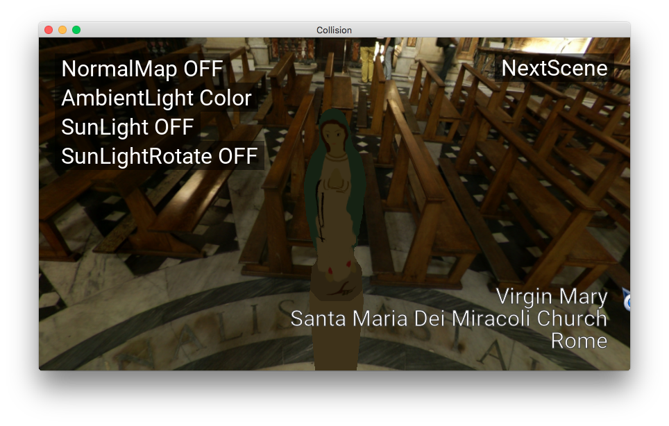
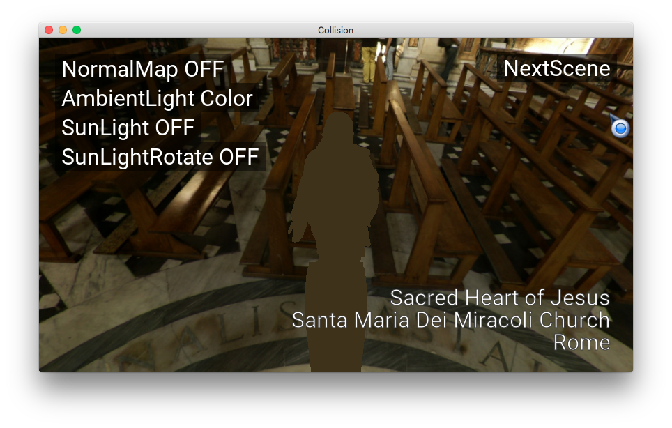
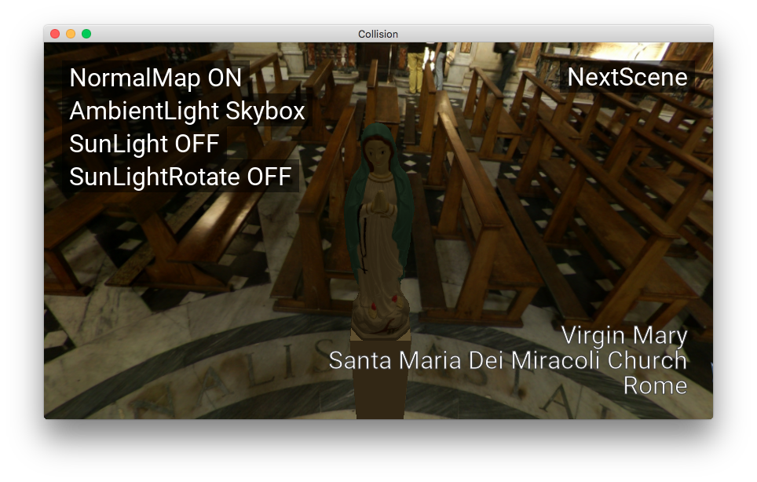
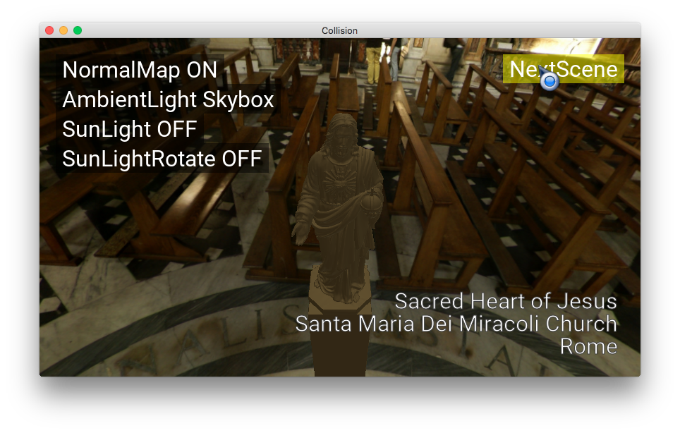
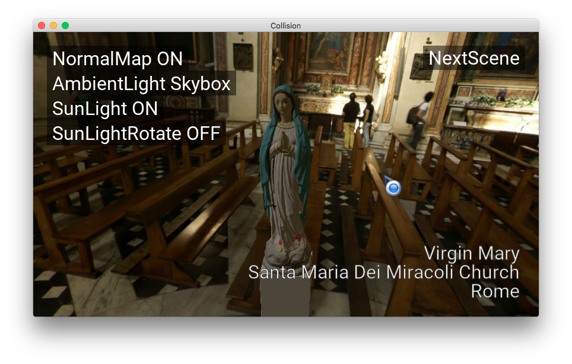
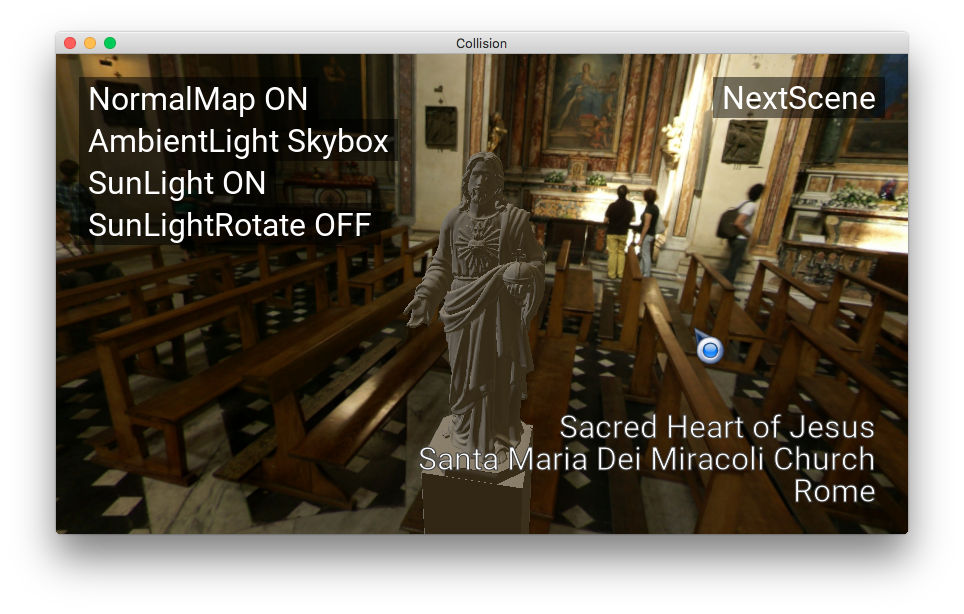
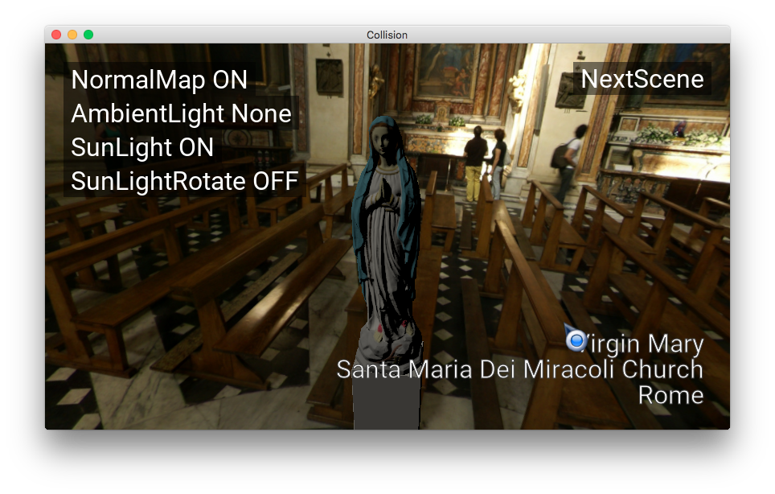
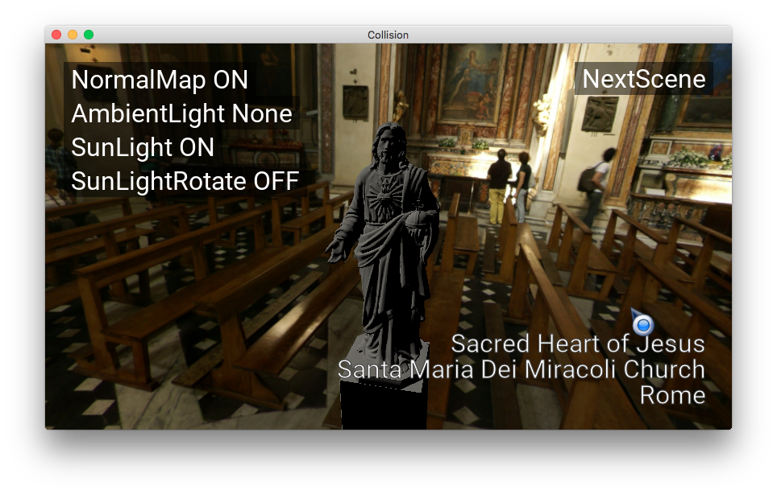

# OpenGLStarter

[Back to HOME](../index.md)

## [/projects/tech-demo-pbr]

[](https://www.youtube.com/watch?v=caaHS1rshH0){:target="_blank" rel="noopener"}


## Technology Concepts

For my surprise, there are a lot of very good material about PBR in the internet.

I used two main references to start my implementation:

[The Naty Hoffman presentation](https://www.youtube.com/watch?v=j-A0mwsJRmk){:target="_blank" rel="noopener"}

[The LearnOpenGL.com](https://learnopengl.com/PBR/Lighting){:target="_blank" rel="noopener"}

In summary PBR is a illumination model or a lighting model proposed by Cook-Torrance.

It uses real objects properties and lights properties to feed the lighting model.

## The Implementation

I started to code a kind of implementation called Forwarding Lighting.

It is based on do a sum of each light component in a render pass following the equation:

__Result = ambientLight + LightComponent1 + LightComponent2 + ... + LightComponentN__

This form fits well for the Phong illumination model.

When we work with PBR we need to consider the image and monitor output gamma value, know as gamma space also.

The Phong illumination model is an empirical model that uses the computer to generate graphics.

PBR in other hand is a model based on real light interaction with surfaces. It is meant to be used in linear space.

To implement the correct PBR equations we need to use the sum in the form:

__Result = (ambientLight + LightComponent1 + LightComponent2 + ... + LightComponentN)<sup>gamma</sup>__


## Gamma Correction: Problem and Solution

To do the sum with the gamma value, we can use the [FRAMEBUFFER_SRGB](https://www.khronos.org/registry/OpenGL/extensions/ARB/ARB_framebuffer_sRGB.txt){:target="_blank" rel="noopener"} extension in OpenGL.

The graphics hardware do the sum considering the gamma value.

__Problem:__ The Raspberry Pi 3 Model B+ do not do this kind of sum...

The solution found was to compute all light contribution in a single pass shader.

To deal with this restriction I come up with the FrankenShader.

## FrankenShader

This shader is created and compiled dynamically according the current material and light setup of the scene.

The algorithm mounts the equation parts using as basis the parameter set (object material and light setup).

We can see an example of a shader created to work with color ambient light, normalmap and sun light in the code below:

```cpp
// Compiling FrankenShader
// --------------------------
//   normalMap: 1
//   ambientLightColor: 1
//   ambientLightSkybox: 0
//   sunLight0: 1
//   sunLight1: 0
//   sunLight2: 0
//   sunLight3: 0
// 
// VERTEX SHADER
// 
attribute vec4 aPosition;
attribute vec3 aUV0;
uniform mat4 uMVP;
varying vec2 uv;
attribute vec3 aNormal;
attribute vec3 aTangent;
varying mat3 worldTBN;
uniform vec3 uCameraPosWorld;
varying vec3 viewWorld;
uniform mat4 uLocalToWorld;
uniform mat4 uLocalToWorld_it;
void main(){
  uv = aUV0.xy;
  vec3 N = normalize( uLocalToWorld_it * vec4( aNormal, 0.0 ) ).xyz;
  vec3 T = normalize( uLocalToWorld * vec4( aTangent, 0.0 ) ).xyz;
  T = normalize(T - dot(T, N) * N);
  vec3 B = cross(T, N);
  worldTBN = mat3(T,B,N);
  viewWorld = (uCameraPosWorld - (uLocalToWorld * aPosition).xyz);
  gl_Position = uMVP * aPosition;
}
// 
// FRAGMENT SHADER
// 
varying vec2 uv;
uniform vec4 uMaterialAlbedoColor;
uniform float uMaterialRoughness;
uniform float uMaterialMetallic;
uniform sampler2D uTextureAlbedo;
varying vec3 viewWorld;
varying mat3 worldTBN;
uniform sampler2D uTextureNormal;
uniform vec3 uAmbientColor;
uniform vec3 uLightRadiance0;
uniform vec3 uLightDir0;
vec3 fresnelSchlick(float cosTheta, vec3 F0){
  return F0 + (1.0 - F0) * pow(1.0 - cosTheta, 5.0);
}
float DistributionGGX(vec3 N, vec3 H, float roughness){
  float a      = roughness*roughness;
  float a2     = a*a;
  float NdotH  = max(dot(N, H), 0.0);
  float NdotH2 = NdotH*NdotH;
  float num   = a2;
  float denom = (NdotH2 * (a2 - 1.0) + 1.0);
  denom = 3.14159265358 * denom * denom;
  return num / denom;
}
float GeometrySchlickGGX(float NdotV, float roughness){
  float r = (roughness + 1.0);
  float k = (r*r) / 8.0;
  float num   = NdotV;
  float denom = NdotV * (1.0 - k) + k;
  return num / denom;
}
float GeometrySmith(vec3 N, vec3 V, vec3 L, float roughness){
  float NdotV = max(dot(N, V), 0.0);
  float NdotL = max(dot(N, L), 0.0);
  float ggx2  = GeometrySchlickGGX(NdotV, roughness);
  float ggx1  = GeometrySchlickGGX(NdotL, roughness);
  return ggx1 * ggx2;
}
vec3 computePBR(vec3 albedo, vec3 radiance, vec3 N, vec3 V, vec3 L, vec3 H){
  vec3 F0 = vec3(0.04);
  F0      = mix(F0, albedo, uMaterialMetallic);
  vec3 F  = fresnelSchlick(max(dot(H, V), 0.0), F0);
  float G = GeometrySmith(N, V, L, uMaterialRoughness);
  float NDF = DistributionGGX(N, H, uMaterialRoughness);
  vec3 numerator    = NDF * G * F;
  float denominator = 4.0 * max(dot(N, V), 0.0) * max(dot(N, L), 0.0);
  vec3 specular     = numerator / max(denominator, 0.001);
  vec3 kS = F;
  vec3 kD = vec3(1.0) - kS;
  kD *= 1.0 - uMaterialMetallic;
  float NdotL = max(dot(N, L), 0.0);
  return (kD * albedo * 3.18309877326e-01 + specular) * radiance * NdotL;
}
vec3 readNormalMap(){
  vec3 normal = texture2D(uTextureNormal, uv).xyz;
  normal = normal * 2.0 - 1.0;
  normal = worldTBN * normal;
  return normalize(normal);
}
void main(){
  vec4 texel = texture2D(uTextureAlbedo, uv) * uMaterialAlbedoColor;
  vec3 V = normalize(viewWorld);
  vec3 L,H,radiance;
  vec3 N = readNormalMap();
  vec3 albedo = texel.rgb;
  texel.rgb = vec3(0);
  texel.rgb += albedo * pow(uAmbientColor, vec3(2.2));
  L = -uLightDir0;
  H = normalize(V + L);
  radiance = uLightRadiance0;
  texel.rgb += computePBR(albedo,radiance,N,V,L,H);
  gl_FragColor = texel;
}
```

If you want to see the algorithm that generates the shader, you can see it hereOpens in a new window.

## Results

The assets I got from:

* [Humus skybox website](http://www.humus.name/index.php?page=Textures){:target="_blank" rel="noopener"}
* [Cults3D Virgin Mary 3D model](https://cults3d.com/en/3d-model/art/virgin-mary){:target="_blank" rel="noopener"}
* [Cults3D Jesus Sacred Heart 3D model](https://cults3d.com/en/3d-model/art/jesus-for-remixes){:target="_blank" rel="noopener"}

To generate the low poly 3D version of the models and generate the normalmap I used the [Blender](https://www.blender.org/){:target="_blank" rel="noopener"}.

It is possible to see in the images below that the 3D model blends nicely with the background.

The images below show the 3D Model with just the ambient light color:





Next, the images below show the ambient light from skybox and the normalmap:





Next, We can see the illumination area by enabling the sun light:





Finally we can se only the sunlight without the ambient light component:






